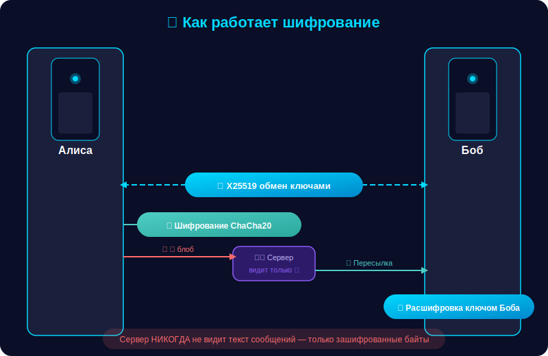
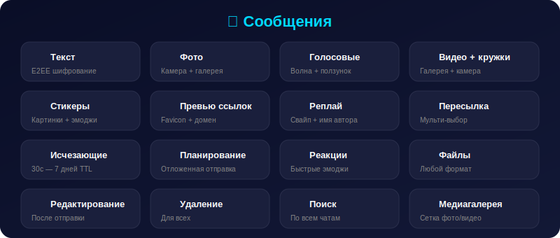
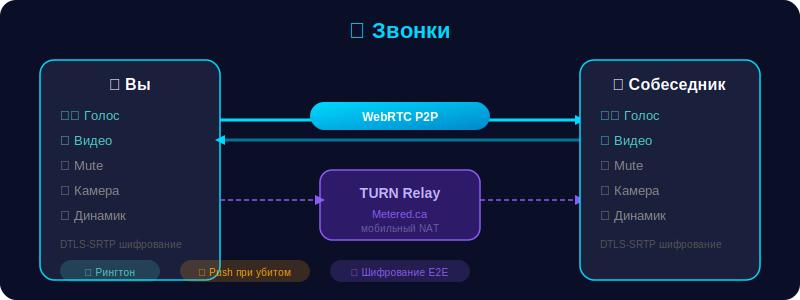
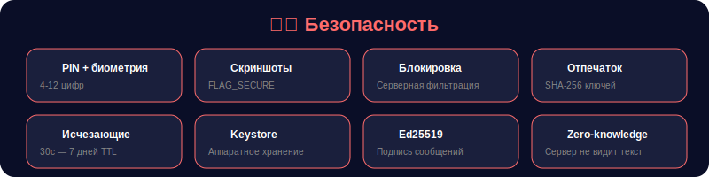
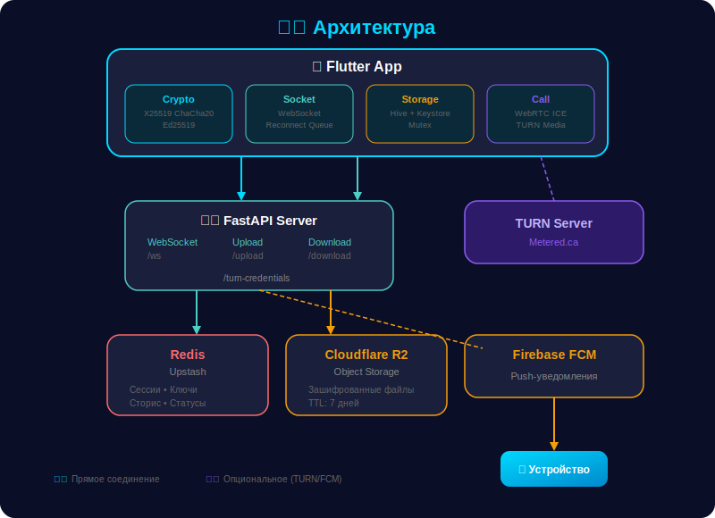

# 👻 DDChat — Защищённый Мессенджер

<p align="center">
  
  
  
  
</p>

<p align="center">
  <b>Мессенджер со сквозным шифрованием, звонками, сторис и нулевым доступом сервера к данным.</b>
</p>

---

## 🔐 Как работает шифрование

<p align="center">
  
</p>

| Слой | Алгоритм | Назначение |
|------|----------|------------|
| Обмен ключами | X25519 (ECDH) | Общий секрет для каждого чата |
| Шифрование | ChaCha20-Poly1305 | Симметричное AEAD шифрование |
| Подпись | Ed25519 | Аутентификация отправителя |
| Файлы | ChaCha20-Poly1305 | Шифрование до загрузки на сервер |
| Хранение ключей | Argon2 + ChaCha20 | Приватные ключи под паролем |
| Токены | Android Keystore | Аппаратное защищённое хранилище |
| Звонки | DTLS-SRTP | Шифрование медиапотока WebRTC |

---

## ✨ Возможности

### 💬 Сообщения

<p align="center">
  
</p>

### 📞 Звонки

<p align="center">
  
</p>

- **Голосовые и видеозвонки** — P2P через WebRTC
- **TURN-сервер** — работает на мобильном интернете за NAT
- **Рингтоны** — разные мелодии для входящих и исходящих
- **Push-уведомления** — полноэкранный звонок даже при убитом приложении

### 👥 Группы

- **Зашифрованный групповой чат** — симметричный ключ группы
- **Админ-панель** — назначение/снятие админов, исключение участников
- **Права** — только админы пишут, только админы приглашают
- **Описание и название** — редактирование из настроек группы
- **Медиафайлы** — фото, видео, файлы в групповых чатах

### 📢 Каналы

- Публичные каналы с подпиской по ссылке `deepdrift://channel/ch_xxx`
- Только владелец публикует — подписчики читают
- Без E2EE — максимальная скорость для трансляций

### 📸 Сторис / Статусы

- **Текстовые истории** — 8 цветов фона, крупный текст
- **Фото-истории** — камера или галерея с подписью
- **24 часа** — автоудаление, хранение в Redis
- **Instagram-style просмотр** — прогресс-бары, тап навигация, пауза
- **Реакции** — ❤️🔥😂😮😢👍 с уведомлением автора
- **Счётчик просмотров** — кто смотрел вашу историю

### 🛡️ Безопасность

<p align="center">
  
</p>

### 🎨 Интерфейс

- **Тёмная и светлая тема** — переключатель в настройках
- **Зелёные точки онлайн** на аватарах контактов
- **Бейджи непрочитанных** сообщений
- **Глобальный поиск** по всем чатам
- **Медиагалерея** — сетка фото/видео в каждом чате
- **Автозагрузка** — файлы восстанавливаются при возврате в чат
- **Прогресс скачивания** — процент при загрузке файлов
- **Волна голосовых** — реальные амплитуды + ползунок перемотки

---

## 🏗️ Архитектура

<p align="center">
  
</p>

---

## 📂 Структура проекта

```
deepdrift-secure-main/
├── lib/
│   ├── main.dart                      # Точка входа, тема, FCM
│   ├── home_screen.dart               # Список чатов, табы, сторис
│   ├── chat_screen.dart               # Чат: медиа, реакции, планирование
│   ├── settings_screen.dart           # Настройки, безопасность, тема
│   ├── lock_screen.dart               # PIN + биометрия
│   ├── crypto_service.dart            # E2EE: X25519, ChaCha20, Ed25519
│   ├── socket_service.dart            # WebSocket клиент, реконнект
│   ├── storage_service.dart           # Hive БД, защищённое хранилище
│   ├── notification_service.dart      # FCM, уведомления, звонки
│   ├── theme_service.dart             # Переключатель тем
│   ├── config/
│   │   └── app_config.dart            # URL сервера, константы
│   ├── models/
│   │   └── chat_models.dart           # Типы сообщений, форматирование
│   ├── screens/
│   │   ├── call_screen.dart           # UI звонков
│   │   ├── channels_screen.dart       # Браузер каналов
│   │   ├── channel_chat_screen.dart   # Чат канала
│   │   ├── media_gallery_screen.dart  # Галерея медиа
│   │   ├── group_settings_screen.dart # Админ-панель групп
│   │   ├── story_viewer_screen.dart   # Просмотр сторис
│   │   └── create_story_screen.dart   # Создание сторис
│   ├── widgets/
│   │   ├── message_bubble.dart        # Пузырь сообщения
│   │   ├── sticker_picker.dart        # Стикеры и эмоджи
│   │   ├── stories_bar.dart           # Полоска сторис
│   │   └── video_players.dart         # Видеоплееры
│   └── services/
│       └── call_service.dart          # WebRTC, ICE, TURN
├── android/
│   ├── app/build.gradle               # Signing config
│   ├── key.properties                 # Пароли keystore
│   └── deepdrift-release.jks          # Release keystore
├── assets/
│   ├── ringtone.wav                   # Мелодия входящего
│   └── ringback.wav                   # Гудки исходящего
└── pubspec.yaml                       # Зависимости, версия 3.4.0+5

deepdrift-backend-main/
└── server.py                          # FastAPI сервер
```

> ⚠️ `key.properties` и `.jks` указаны выше только как **локальные** release-артефакты.
> Их нельзя хранить в Git. Добавьте свои локальные файлы и используйте CI secrets.

---

## 🔒 Политика секретов и signing

- Не коммитить: `android/key.properties`, `android/app/key.properties`, `*.jks`, `*.keystore`.
- Все ключи/пароли хранить в CI/CD secrets (GitHub Actions/Render и т.д.).
- Для локальной сборки создавать `key.properties` только на вашей машине.
- Перед релизом проверять историю коммитов на случайные секреты (`git log`, secret scanning).

---

---

## 🚀 Установка

### Бэкенд

```bash
cd deepdrift-backend-main
pip install -r requirements.txt
uvicorn server:app --host 0.0.0.0 --port 10000
```

Переменные окружения (Render / .env):
```env
REDIS_URL=redis://...
R2_ENDPOINT=https://...
R2_ACCESS_KEY=...
R2_SECRET_KEY=...
R2_BUCKET=ddchat-files
FIREBASE_CREDENTIALS={"type":"service_account",...}
TURN_URLS=turn:global.relay.metered.ca:80,turns:global.relay.metered.ca:443
TURN_USER=логин_metered
TURN_PASS=пароль_metered
```

### Фронтенд

```bash
cd deepdrift-secure-main
flutter pub get
flutter build apk --release
```

---

## 📊 История версий

| Версия | Что нового |
|--------|-----------|
| **3.4.0** | Мульти-пересылка, реакции на сторис, release signing, имя в реплаях групп |
| **3.3.0** | Сторис/статусы, просмотр и создание историй |
| **3.2.0** | Превью ссылок, прогресс скачивания, ползунок голосовых, отложенные сообщения, стикеры, админ-панель |
| **3.1.0** | TURN-сервер, стабильность звонков, автозагрузка файлов, исчезающие сообщения, блокировка |
| **3.0.0** | WebRTC звонки, emoji пикер, свайп-реплай, медиагалерея |

---

## 🤝 Стек технологий

| Компонент | Технология |
|-----------|-----------|
| Клиент | Flutter / Dart |
| Сервер | FastAPI / Python 3.11 |
| БД | Redis (Upstash) |
| Файлы | Cloudflare R2 |
| Пуши | Firebase Cloud Messaging |
| Звонки | WebRTC + TURN (Metered.ca) |
| Шифрование | X25519 + ChaCha20 + Ed25519 |
| Хранение | Hive + Android Keystore |

---

## ✅ CI / Quality Gates

- GitHub Actions workflow: `.github/workflows/ci.yml`
- Автоматические проверки на PR:
  - `flutter analyze`
  - `flutter test`
  - синхронность версии `pubspec.yaml` и README-бейджа (`scripts/check_readme_version.py`)
  - отчёт `flutter pub outdated` как артефакт

---

<p align="center">
  <i>«Приватность — это не о том, что тебе есть что скрывать.<br>Это о том, что тебе есть что защитить.»</i>
</p>

<p align="center">
  <b>👻 DDChat</b> — твои сообщения, твои правила.
</p>
